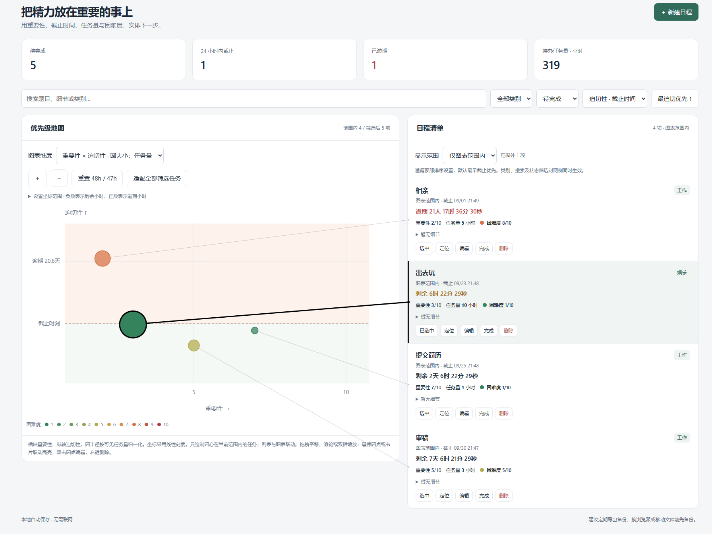
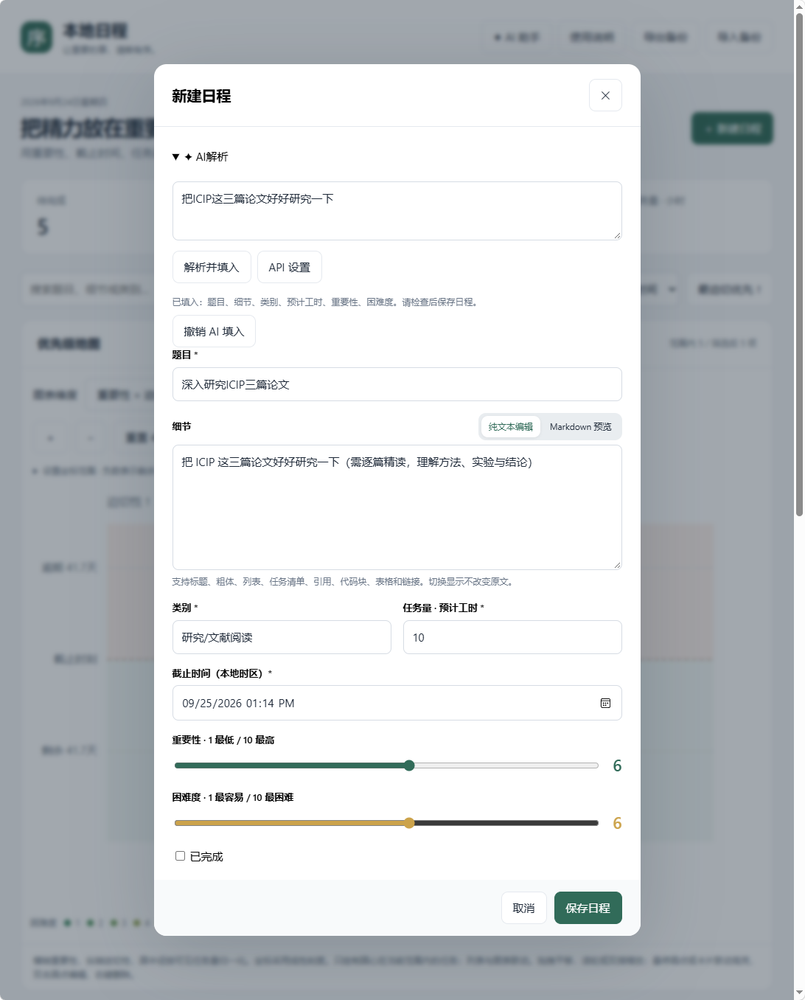

# SimpleSchedule · 本地日程

一个单文件日程管理工具，使用 HTML、CSS 和 JavaScript 编写。通过简洁的二维气泡地图管理任务，支持 Markdown 细节、本地保存，以及调用 LLM 辅助撰写和安排当天工作。

基础日程功能可离线使用；AI 功能需要联网，并使用你自己的 API Key。

## 界面预览

默认只显示“重要性 × 迫切性”地图，圆圈旁的标题标签连接到对应日程；点击查看详情。待完成、24 小时内截止、已逾期和待办工时收在默认关闭的“日程统计”中。列表暂时隐藏。

以下为早期界面截图，布局以当前版本为准：



## 快速开始

1. 下载仓库中的 [index.html](./index.html)，或通过 GitHub 的 **Code → Download ZIP** 下载并解压。
2. 将 HTML 文件保存在固定文件夹，用 Windows 上的 Edge 或 Chrome 打开。
3. 点击 **＋ 新建日程**，填写任务并保存。

不需要安装 Python、Node.js，也不需要构建或启动服务器。GitHub 文件页面用于查看源码，使用软件时请下载后在浏览器中打开。

## 日程管理

每个日程包含以下内容：

| 字段 | 含义 |
| --- | --- |
| 题目 | 任务名称 |
| 细节 | 纯文本或 Markdown 内容 |
| 类别 | 自定义类别，例如科研、工作、学习、生活 |
| 重要性 | 任意有限正负浮点数，横轴数值；默认 0 |
| 迫切性 | 任意有限正负浮点数，纵轴数值；默认 0，与截止时间独立 |
| 截止时间 | 输入本地截止时间，单独计算剩余时间或逾期时长 |
| 任务量 | 预计工时，单位为小时，支持小数 |
| 困难度 | 1–10，数值越大越困难 |
| 完成状态 | 待完成或已完成，可恢复为待完成 |

支持搜索题目、细节和类别，按类别、完成状态筛选。列表与排序入口暂时隐藏。折叠统计显示全部日程的待完成数量、24 小时内截止数量、逾期数量和待办总工时，不随地图筛选改变。

点击题目可编辑任务。删除前会确认，删除后可在 **12 秒内撤销**。

### Markdown 细节

在任务编辑窗口中输入原文，点击 **Markdown 预览** 查看排版，随时可以切回 **纯文本编辑**。切换不会改变原文，保存时会保留显示模式。

支持标题、粗体、列表、任务清单、引用、代码块、表格和链接。例如：

```markdown
## 实验分析

- [ ] 整理实验结果
- [ ] 绘制对比图
- [ ] 撰写结论

**验收标准**：完成表格、图像和对应分析。
```

原始 HTML 按文字显示；远程图片显示为说明和链接，不自动加载。Markdown 任务清单用于内容展示，不会自动改变日程的完成状态。

## 二维地图

只提供“重要性 × 迫切性”：横轴为重要性，纵轴为迫切性（越靠上越迫切）；圆圈半径按当前可见任务量做 min-max 归一化，颜色表示困难度。重要性和迫切性均为可编辑的独立数值，不再限制为 1–10，也不再由剩余时间计算。默认两个坐标轴均为 −10 至 +10；支持自由拖动、缩放及自定义数值范围。

电脑与手机均只显示地图。每个可见圆圈旁有标题标签和连接线；点击圆圈或标签查看细节、截止倒计时和参数，可继续编辑、标记完成、恢复或删除。长标题在标签中省略，详情显示全文。

拖拽平移，滚轮或双指缩放，也可使用放大、缩小和精确坐标范围。“适配全部筛选任务”用于查看当前范围外的日程。搜索、类别和状态筛选继续生效。任务密集时标签可能重叠，可放大查看。

统计在“日程统计”折叠项内，每次打开页面默认收起，展开后查看待完成、24 小时内截止、已逾期及待办总工时。收起不会停止统计更新。列表及排序入口暂时隐藏，不删除任何日程数据。

### 在地图位置创建日程

电脑在绘图区右键，手机按住约 550ms，会出现仅含“创建日程”的菜单。点击后打开新建表单，自动将该位置的横轴数值填为重要性、纵轴数值填为迫切性。坐标使用当前平移、缩放后的视野换算，不影响截止时间。确认保存后才创建任务，取消表单不会新增数据。

移动手指、双指缩放、抬手或取消触摸会取消尚未触发的长按；长按结束不会再误触日程详情。菜单支持点击外部或按 Esc 关闭。编辑、完成、删除仍可在日程详情中操作。

## AI 助手

### 配置 API

点击右上角 **✦ AI 助手**，填写以下设置并点击 **保存设置**：

| 设置 | 填写方式 |
| --- | --- |
| Base URL | 服务商提供的 OpenAI 兼容接口基础地址，通常以 `/v1` 结尾 |
| 模型 | 你的账号可调用的模型标识 |
| API Key | 对应服务商的 API 密钥 |

当前代码预填的 Base URL 为 `https://api.minimax.cn/v1`，模型为 `MiniMax-M2.5`。这些是可编辑的默认值，不代表已验证你的账号、区域或套餐可用；请以所用服务商控制台提供的地址和模型为准。

程序会在 Base URL 后追加 `/chat/completions`，因此不要在 Base URL 中重复填写这一部分。请求使用 Bearer 鉴权和 OpenAI 风格的 `messages`，从 `choices[0].message.content` 读取回答。

### 使用方式

- **生成今日汇报**：汇总日程状态、今日截止任务、逾期任务与风险。
- **给出今日完成建议**：结合重要性、截止时间、任务量和困难度，建议当天的行动顺序。
- **发送问题**：输入日程相关问题，或按 **Ctrl / Command + Enter** 发送。
- **AI解析**：在新建/编辑日程中展开“AI解析”，粘贴一段文字并点击“解析并填入”。仅提取能确定的字段，不追问、不联网查询，不确定项保持原值或默认值。
- **AI补全**：电脑端在日程输入框上停留约 650ms，手机端在输入框双击，出现“AI补全”按钮；点击后，根据当前日程已确定的信息，仅补全该字段。键盘用户可在输入框按 F2。悬停或双击本身不调用 API。



每次请求都会重新获取当前本地日期、时间、时区、UTC 偏移及 UTC 时间，让模型据此理解“今天”和“明天”。

汇报和普通问答以 Markdown 展示。表单内的 AI解析/AI补全直接填入当前编辑表单，检查后点击“保存日程”才会保存；可撤销上次 AI 填入。重要性与迫切性改用支持正负小数的数字输入框；困难度保留原有滑块，不增加候选列表或多轮对话。请求期间手动修改的信息不会被旧结果覆盖，关闭编辑窗口会取消请求。

### 日程上下文与数据范围

汇报、今日建议和普通问答请求附带**全部日程**的题目、细节、类别、重要性、迫切性、困难度、预计工时、截止时间和完成状态，包括已完成任务；页面筛选不会缩小发送范围。表单 AI解析/AI补全仅发送本次文本及当前日程已确定的字段，不发送其他日程。新建表单中尚未确认的默认参数不作为推断依据。

这些内容发送至你配置的 API 服务。基础日程操作在本地完成，不需要调用模型。

当前数据没有记录任务完成时间，因此 AI 不能可靠判断哪些任务是在今天完成的。提示词已明确提醒模型：不要将所有已完成任务视为今日完成。

## 本地保存与备份

日程和 API 设置保存在当前浏览器的 `localStorage` 中：

| 本地存储项 | 内容 |
| --- | --- |
| `focus-schedule-v1` | 日程数据；当前导出格式为版本 4，包含独立 urgency 字段 |
| `focus-schedule-ai-v1` | Base URL、模型和 API Key |

API Key 以未加密形式保存在浏览器本地存储中；密码输入框只隐藏屏幕显示。Key 不包含在日程 JSON 备份中，也不会由应用自动上传到 GitHub，但调用模型时会作为鉴权信息发送至配置的 API 地址。

请固定使用同一浏览器、同一浏览器配置和同一文件位置，避免无痕模式。清除浏览器数据、移动或重命名文件、切换浏览器后，原数据可能无法继续读取。

### 导出和导入

- 点击 **导出备份**，下载日程 JSON 文件。
- 点击 **导入备份**，选择以前导出的文件。
- 导入采用合并方式：相同 ID 的任务以备份内容更新，其余现有任务保留；执行前会显示确认信息。
- 支持版本 1、2、4 的备份。读取旧版本（1、2）时，将迫切性初始化为 0，保留原有重要性、截止时间及其他日程数据；版本 1 的困难度默认为 5，细节模式默认为纯文本。版本 4 校验重要性、迫切性必须为有限数值，不接受 NaN / Infinity。旧版软件无法读取版本 4 备份。
- 导入文件上限为 30 MB，日程列表上限为 20,000 条；格式不合法时不导入。

建议更新软件前先导出备份。更换文件位置或设备时，可通过导入恢复任务，并重新填写 AI 设置。

## 常见问题

### AI 请求失败

检查 Base URL、模型名称、API Key 和服务商账号状态。浏览器控制台与页面错误提示可用于区分网络问题和接口错误。

浏览器直连 API 需要服务端允许相应的跨域访问（CORS），从本地文件打开时也可能受到限制。更换为本地 HTTP 页面不一定能解决 API 的跨域限制；如果服务商不允许浏览器直连，需要自行配置受控后端代理。本仓库目前不包含代理服务。

接口采用一次性返回，尚不支持流式显示、取消请求和自动重试。

### 为什么另一台电脑没有日程？

日程数据保存在各自浏览器中，没有云端账号或跨设备自动同步。请使用 JSON 导出、导入迁移。GitHub 仓库保存的是应用代码，不是你浏览器中的日程数据库。

### 关闭页面后会提醒吗？

目前没有后台通知或定时提醒功能。截止倒计时和图表刷新仅在页面运行时工作。

## 开发说明

项目入口为 [index.html](./index.html)。样式、业务逻辑和 Markdown 解析器均包含在单个文件内，无构建步骤。

修改时请保留已有存储键和备份兼容逻辑。建议检查任务新增、编辑、删除撤销、导入导出、两种图表以及 AI 请求中的日期与时区；API 行为需要使用自己的有效 Key 在实际浏览器中验证。

Markdown 解析使用内嵌的 **Marked 17.0.5**，相关第三方许可声明保留在 HTML 文件中。


## 服务器部署

仓库现在可直接作为静态网站目录使用，无需构建。推荐在服务器上将仓库克隆到固定目录，例如：

```bash
sudo mkdir -p /var/www
cd /var/www
sudo git clone https://github.com/Dmsw/SimpleSchedule.git simpleschedule
```

Nginx 的站点根目录直接指向 `/var/www/simpleschedule`，入口文件为 `index.html`。仓库中的 [deploy/README.md](./deploy/README.md) 提供了完整的 Nginx、HTTPS 和更新说明。

后续更新网站可在服务器执行：

```bash
cd /var/www/simpleschedule
./deploy/update.sh
```

该脚本使用 `git pull --ff-only`，静态文件更新后无需重启 Nginx。


## 后续计划

1. 提供手机端支持，更好的UI

2. 使用OneDrive进行多端共享

3. AI自动解析日程

## 手机适配

手机与电脑采用相同的单地图模式。手机支持单指平移、双指缩放，使用底部详情面板和固定新建按钮；菜单、筛选及统计均可按需展开。横竖屏切换保留地图模式。

运行 `node tests/mobile.cjs` 检查地图与折叠统计逻辑。测试使用模拟 DOM，实际布局仍需浏览器验证。

表单 AI 逻辑测试：`node tests/ai-form.cjs`。使用模拟接口验证字段提取、默认值保留、单字段填入、撤销、输入变化/取消请求和悬停/双击触发；真实模型与手机浏览器效果需使用自己的 Key 试用。

### 电脑端直接拖动圆圈

- 鼠标移到圆圈内部显示抓取光标，按住拖动可修改重要性和迫切性，位置限制在当前绘图区内；拖动空白区域仍平移地图。
- 鼠标移到圆圈边缘显示相应方向的缩放光标，按住拖动可调整圆半径和任务量。以按下时的半径为基准，任务量按半径比的平方变化（范围仍为 0.1–100000 小时）。
- 拖动时冻结可见任务的尺寸归一化，仅预览当前圆圈。松开才保存，并重新按当前可见任务归一化。因此最大/最小圆圈或只有一个圆圈时，松开后的显示尺寸可能回到归一化端点或固定半径，任务量仍保存并显示提示。
- 按 Esc、窗口失去焦点、丢失指针捕获或窗口尺寸变化会取消本次拖动。拖动期间其他修改不会被覆盖。轻点圆圈仍打开详情。
- 此交互仅用于电脑鼠标/笔，手机单指平移、长按创建和双指缩放保持原有操作。

运行 `node tests/bubble-edit.cjs` 验证移动、缩放、保存、取消及触屏排除；测试使用模拟 DOM，实际光标与拖动体验待浏览器审核。
